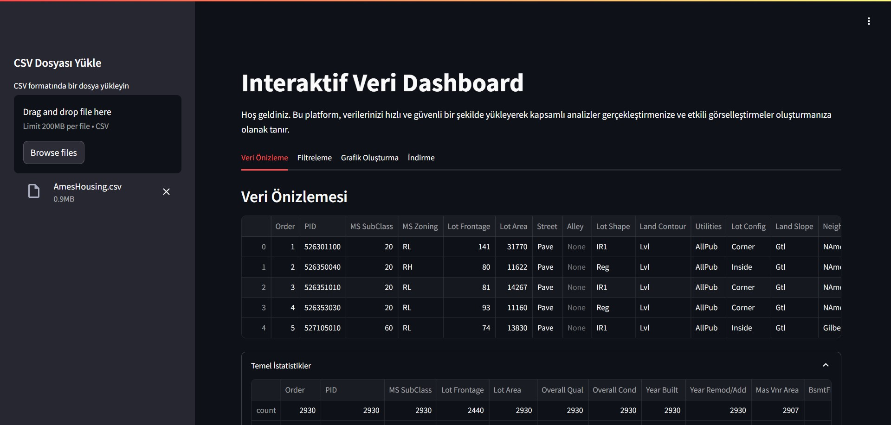

# Interaktif Veri Dashboard

Bu proje, kullanıcıların CSV formatındaki verilerini hızlı ve sezgisel bir şekilde analiz edebilmesini sağlayan, Streamlit tabanlı etkileşimli bir web uygulamasıdır.

## Ekran Görüntüsü

## Özellikler

- CSV dosyası yükleyerek veri analizi başlatma  
- Veri önizleme ve temel istatistikleri görüntüleme  
- Eksik verileri analiz etme ve doldurma (mean, median, mode)  
- Aykırı değer analizi (IQR yöntemine göre)  
- Bar, Line, Scatter, Pie, Histogram grafik türlerini seçerek veri görselleştirme  
- Temizlenmiş veriyi indirme (CSV, Excel, JSON)  
- Seçilen grafiği PNG olarak dışa aktarma  

## Canlı Uygulama

Uygulamayı hemen tarayıcınızdan çalıştırabilirsiniz:

[Hugging Face Spaces Üzerinde Uygulama](https://kuubraucar1-datadashboard1.hf.space/)

## Kullanılan Teknolojiler

- Python 3.11+
- Streamlit
- Plotly
- Matplotlib
- Pandas
- Hugging Face Spaces
